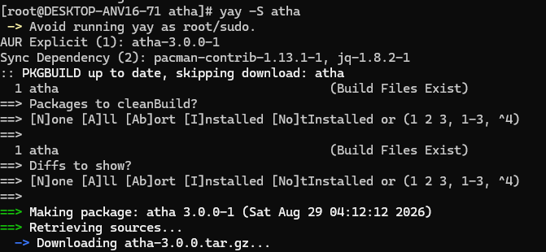
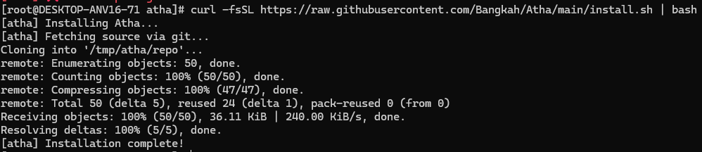
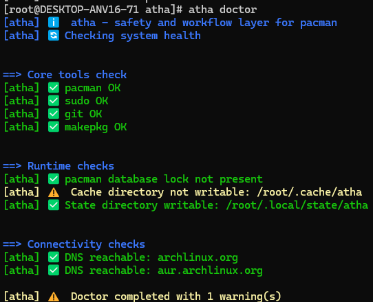
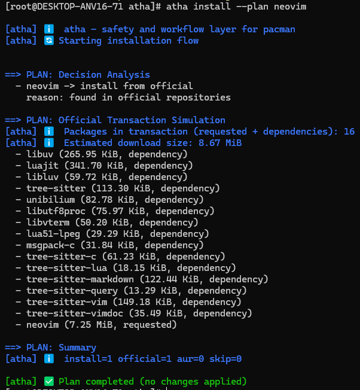
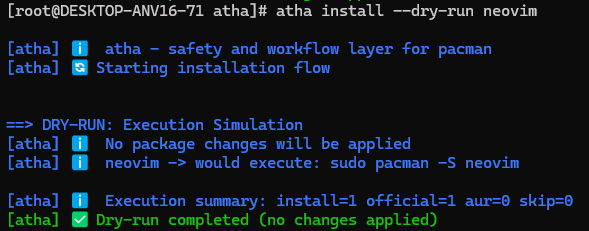
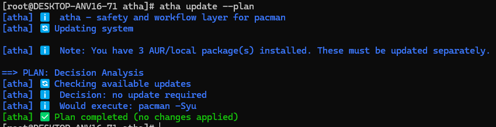
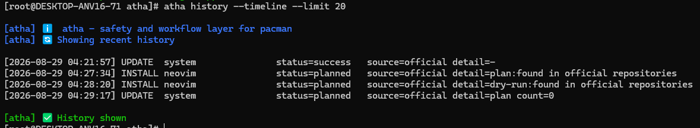

# ATHA

<div align="center">
  
</div>

<p align="center">
  <a href="https://aur.archlinux.org/packages/atha"></a>
  <a href="LICENSE"></a>
  <a href="https://github.com/Bangkah/Atha"></a>
</p>

**ATHA** is a Rust safety and workflow layer for `pacman` on Arch Linux.

It is designed to improve package-operation safety, decision transparency, and operational auditability while seamlessly preserving native Arch Linux behavior.

---

## Project Identity

ATHA is **not** a `pacman` replacement, nor is it a `yay` clone. 

ATHA focuses on:
- **Safer package workflows** before execution.
- **Clearer operational decisions** and execution previews.
- **Local history logging** for post-operation auditing.

Daily package operations are often too opaque for routine use. ATHA addresses this by making package workflows explicit before execution, traceable afterward, and consistent across commands.

## Core Pillars

1. **Safety**
   - Execution simulation via `--dry-run` mode.
   - Confirmation layer for all package-changing operations.
2. **Transparency**
   - Decision analysis via `--plan` mode.
   - Source selection visibility (Official Repositories vs. AUR).
   - Detailed transaction simulation (download sizes & dependencies) prior to installation.
3. **Auditability**
   - Structured local history of all transactions.
   - Timeline and summary views for system auditing.
   - Action and status filtering.

## Feature Comparison

| Feature | `pacman` | `yay` | **ATHA** |
| :--- | :---: | :---: | :---: |
| Workflow-level dry-run | ❌ | Limited | ✅ |
| Decision plan mode | ❌ | Limited | ✅ |
| Plan explanation layer | ❌ | ❌ | ✅ |
| Install transaction simulation | ❌ | ❌ | ✅ |
| Local operation timeline | ❌ | ❌ | ✅ |
| History summary & filters | ❌ | ❌ | ✅ |
| Built-in environment doctor | ❌ | ❌ | ✅ |

## Requirements

- Arch Linux
- `pacman`, `sudo`
- `git` & `base-devel` *(Standard requirements for AUR builds)*
- Network access *(for AUR RPC API fallback)*
- `pacman-contrib` *(For safe system update checks)*

## Installation

### Arch User Repository (Recommended)
You can install ATHA using your favorite AUR helper:
```bash
yay -S atha
```


### One-line Installer (curl)

```bash
curl -fsSL https://raw.githubusercontent.com/Bangkah/Atha/main/install.sh | bash
```


## Quick Start

Verify your environment health:

```bash
atha doctor
```


Simulate an installation without making changes:

```bash
atha install --plan neovim
atha install --dry-run neovim
```



Check system updates safely:

```bash
atha update --plan
```


Audit your recent package transactions:

```bash
atha history --timeline --limit 20
```


## Command Reference

```bash
atha install [--plan|--dry-run] [--yes] <pkg> [pkg2 ...]
atha remove  [--plan|--dry-run] [--yes] <pkg> [pkg2 ...]
atha search  <keyword>
atha update  [--plan|--dry-run] [--yes]
atha list    [installed|explicit|aur|all] [--limit N]
atha info    <pkg>
atha doctor
atha history [--limit N] [--full|--timeline|--summary] [--action NAME] [--status NAME]
atha --help

```

**Mode Definitions:**

* `--plan`: Decision analysis (explains *what* will happen and *why*).
* `--dry-run`: Execution simulation (shows exactly *which* underlying commands would run).
* `--yes`: Skips confirmation prompts for automated workflows.

## Operational Notes

* **Install:** Automatically skips packages that are already installed and falls back to the AUR when a package is missing from official repositories. The native Rust binary executes external commands with argument arrays (never through a shell).
* **Remove:** Uses `pacman -Rns` to cleanly remove packages along with their unneeded dependencies and configuration files. Skips packages that are not present.
* **Search & Info:** Falls back to querying the AUR API if a package isn't found in the official sync database.
* **Update:** `--plan` and `--dry-run` are non-destructive and utilize `checkupdates` to prevent partial upgrade issues.
* **Doctor:** Exits with a non-zero code when critical dependencies are missing.

## Logs and History Paths

**Logs (Debug Output):**

* Primary: `/tmp/atha.log`
* Fallback: `$XDG_CACHE_HOME/atha/atha.log`

**History (Transaction Audit):**

* `$XDG_STATE_HOME/atha/history.log` (Defaults to `~/.local/state/atha/history.log`)

## Documentation

* [Wiki Home](wiki/Home.md)
* [Installation Guide](wiki/Installation.md)
* [Command Reference](wiki/Commands.md)
* [Troubleshooting](wiki/Troubleshooting.md)
* [Release Notes](wiki/Release-Notes.md)
* [Brand Guidelines](wiki/Brand-Guidelines.md)
* [AUR Reviewer Response](wiki/AUR-Reviewer-Response.md)
* [User Feedback Loop](wiki/User-Feedback-Loop.md)

## Project Links & Maintainer

* **Maintainer:** [Muhammad Dhiyaul Atha](https://mdhiyaulatha.me/) (Bangkah)
* **GitHub Repository:** [Bangkah/Atha](https://github.com/Bangkah/Atha)
* **AUR Package:** [aur.archlinux.org/packages/atha](https://aur.archlinux.org/packages/atha)
* **Issue Tracker:** [Report a Bug or Request a Feature](https://github.com/Bangkah/Atha/issues)

## Branding Assets

* Full logo: [Light](https://www.google.com/search?q=assets/branding/atha-logo-light.svg) | [Dark](https://www.google.com/search?q=assets/branding/atha-logo-dark.svg)
* Mark/icon: [atha-mark.svg](https://www.google.com/search?q=assets/branding/atha-mark.svg)
* Avatar: [atha-avatar.svg](https://www.google.com/search?q=assets/branding/atha-avatar.svg)
* Social banner: [atha-banner.svg](https://www.google.com/search?q=assets/branding/atha-banner.svg)

*(Optional PNG export script using `librsvg` is available in the branding folder).*

## License

This project is licensed under the MIT License. See [LICENSE](https://www.google.com/search?q=LICENSE) for details.
